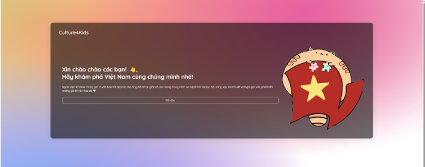

<div align="Center">

# CultureGame
[](https://www.w3schools.com/js/js_htmldom_document.asp)
[](https://nodejs.org/docs/latest/api/)
[](https://nodejs.org/docs/latest/api/)

[](https://docs.npmjs.com/)
<div/>

<div align="Left">

## 📌  Introduction


Virtual Reality (VR) delves into the realm of computer-generated simulations, crafting environments that feel real. By utilizing headsets and other peripherals, VR transcends the limitations of a screen, transporting users into entirely new worlds. 
This technology relies on a complex interplay between hardware and software, working together to create a sense of immersion that blurs the lines between reality and simulation.


A nation's culture is the tapestry woven from the threads of its people's beliefs, traditions, and social practices. 
It encompasses everything from language and religion to art, food, and etiquette.
This shared heritage shapes how people within a nation interact with each other and the world around them, creating a unique identity that transcends generations.


Teaching children their national culture is like giving them a strong foundation. 
It fosters a sense of belonging by connecting them to their history, traditions, and the people who came before them. 
This knowledge builds self-esteem and pride in their heritage. 
It also equips them to understand and appreciate the world around them, fostering tolerance and respect for other cultures.


Exposing children to culture through games is a powerful way to spark curiosity and appreciation for the world around them. 
Play provides a natural and engaging environment where kids can learn about traditions, customs, and languages in a fun and interactive way. 
By participating in cultural games, children develop a sense of identity, foster empathy for others, and gain valuable social skills that prepare them for a diverse world.

## 🚀  Quickstart

```
# Cloning project 
git clone https://github.com/HieuTrungCao/Cutlture4Kids.git

# Changing dictionary
cd CultureGame

# Installing requirements
npm install
```
## 🚴 Usage
```
# Changing dictionary
cd CultureGame

# Running project
npx expo run android
```

## UI
### Home page

<div>